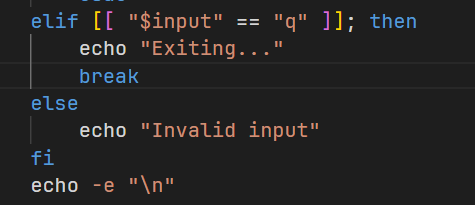
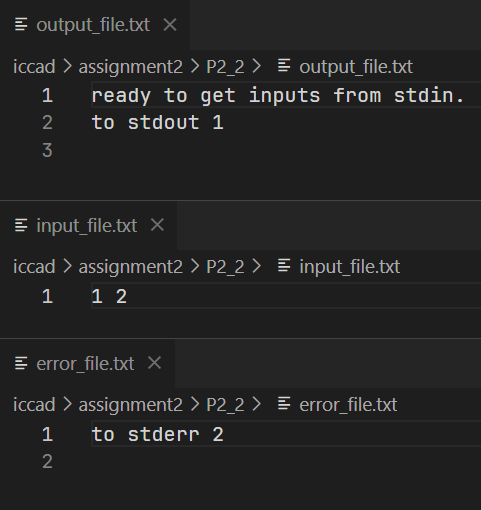
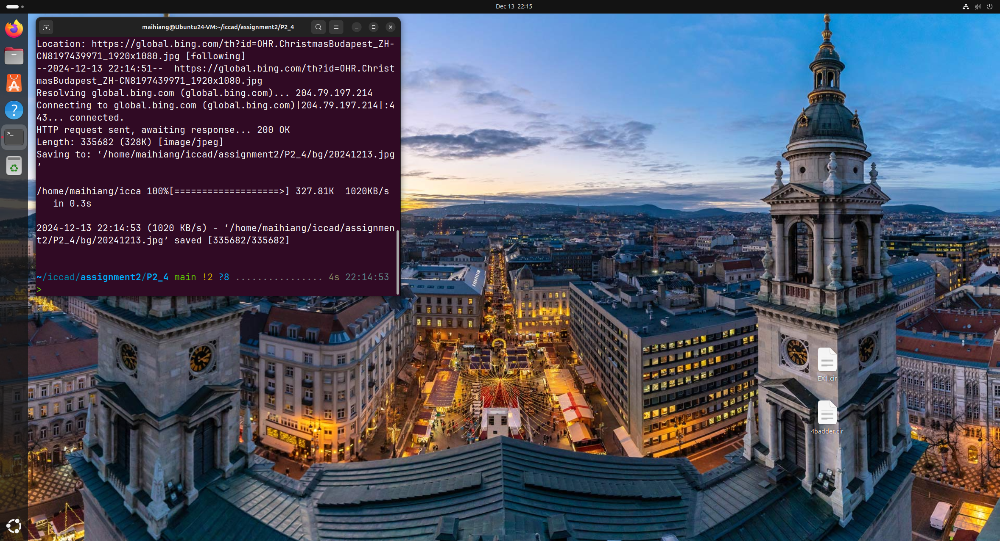

# Q part
## Q2.1
Canonical hopes to bring the spirit of Ubuntu to the world of computers and software through the Ubuntu distribution. Ubuntu in African means 'humanity to others', and the spirit of it is 'I am what I am because of who we are'.
information source: `https://ubuntu.com/about`

## Q2.2
The Apache web server. It was much more cost effective than IIS and NT to build a server farm.
The information appears at 00:32:20 and the following 1 minute of the video.

# P part
All scripts have been packaged in one zip file, and you can find them in folder `P2_n`. The zip file will be uploaded to `course.zju.edu.cn` for archiving purposes because it's safe, reliable and is only access to me and the teacher.
## P2.1
### Script Structure and Analysis
#### Overall Framework
- To write a script without ending, we should use `while true` to create an infinite loop and show menu every time.
- In order to write each function, I choose two different ways:
  - For function 1 and 2 which is easy to implement, I write them in the main script file.
  - For function 3 to 6 which is a bit complex, I write them in other script files and use `source mode*.sh` in the main script file.
- Use `break` when inputing a `q` to break the loop and ends the script.
- Use `read input` to input the number of the function you want, and use `case` code block to execute each function.

#### Function 1 & Function 2
These two functions are close to each other and easy to implement, so I write them in the main script file.
- I define a variable `count` at the beginning of the file, which is initially `0`, and adds `1` each time function 1 works.
- Here I uses `let` function to implement the function below.
- So, when `1` is typed, execute `echo "Hello world"` and let `count` add one. When `2` is typed, show the value of `count`

#### Function 3
1. To list all files under home in long format, I only need to use `ls -l ~`
2. In order to find the line whose file name begins with `h`, I need to use `awk` command with **Regular Expression**
   - In the `awk '{if ($9 ~ /^[hH]/) print "\x1b[43m" $0 "\x1b[0m"; else print $0}'`, `$9` means the 9th column as well as the name of the file, and `($9 ~ /^[hH]/)` examines whether the file name starts with `h`.
   - If the file name starts with `h`, execute `print "\x1b[43m" $0 "\x1b[0m"`. `$0` means the whole line, and `"\x1b[43m"` and `"\x1b[0m"` are used in pair to print the line in a yellow background.
3. Here, `"\x1b[43m"` and `"\x1b[0m"` are called **ANSI Escape Sequences**, which is used to change the output format in shell.

#### Function 4
1. To check if a file exists and is excutable, I use `if [[ -f "$file_name" && -x "$file_name" ]]; then...else...fi`.
2. To show the first 16 bytes in hexadecimal format, I use `head -c 16 $file_name` to show the first 16 characters, each of which stands for actually one bytes.
3. To change the format to hexadecimal, there is a command called `xxd` and is suitable for this.

#### Fuction 5
1. Most of the shell script is familiar to `Function4`.
2. I use a variable to store the first 16 bytes of the file.
3. I use `find . -maxdepth 1` to search for other files in current dirctory, excluding files in the son folder.
4. In the `while` loop, I check if their first 16 bytes are the same as the one I stored. If so, print its name.

#### Function 6
1. As the function 6 will take some time, I first echo some information to keep users patient.
2. As `FTP` is an interactive program, we should use `Here Document` to pass multiple commands.
3. After the `EOF` block which shows files in `/gnu`, use `awk` to check when the file was last edited. It's familiar to `Function 3`.
4. According to `alpha.gnu.org` website and ftp server, the ftp is only access through anonymous account.

#### Quit
If `q` is typed, execute `break` to break the infinite `while` loop and stops the program.

#### Something else
1. After I `touch *.sh`, it's still not executable. I should use `chmod` to change my permission.
2. If `q` is typed, program will give warnings when the variation `input` compares with numbers. So I write a Regular Expression to avoid direct comparision.
3. Everytime the program is ended, the menu will show again, making it difficult to see the result from previous time clearly. So I add `ANSI Escape Code` to highlight the result.
4. The default Vim is not very useful to me, so I choose `neovim` on linux and `vim extension` on VSCode.

## P2.2
As is known to all, `<` is used to redirect stdin, `>` or `>>` is used to redirect stdout and `2>` is used to redirct stderr.
So it's eazy to find the solution: 
`./demo_inout < input_file.txt > output_file.txt 2> error_file.txt`

## P2.3
1. The script is run with arguments, so it's important to use `for domain in "$@";`.
2. In order to check if the ping is success, I can check the return value of `ping`, using `$?`.
3. In order to divide domains into to parts, I use two arraies to store 2 groups of domains.
4. In order to sort two groups in different ways, I can use the `sort` command. `sort -k x` can sort groups of lines by column x.

The script is too long to show in one screenshot, so please refer to `./P2_3/pingsort.sh`

## P2.4
The task can be divided into two steps:
1. Write a script to implement functions below:
   1. Download the dailybing picture to linux.
   2. Set the picture as Desktop wallpaper.
2. Use `crontab` to execute the script every 8:00.

Here are steps:
1. Find the API of dailybing. On the official website, it's easy to find its API `https://dailybing.com/api/v1/{date}/{lang}/{mode}`, and I choose to use `https://dailybing.com/api/v1/today/zh-cn/FHD`.
2. Use `wget -O` to rename the picture downloaded and set the path to store the picture.
3. By searching the Internet, I find the way to change the wallpaper by command: `gsettings set org.gnome.desktop.background picture-uri "file://${path}"`
    - The script is used to set the wallpaper in `Default style` instead of `Dark style`. If you use `Dark style`, the wallpaper won't change. It's obvious that to change the wallpaper of `Dark style`, we should use another command. But I couldn't find it, which is a problem to be solved.
4. Through Step 1 to 3, I have written a script that can implement the functions we want. Use `crontab -e` to make linux execute the script daily by adding `0 8 * * * /home/maihiang/iccad/assignment2/P2_4/script.sh`.

Below is the result I just ran the script, after which the background change immediately.

