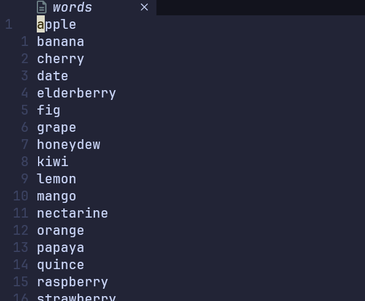

# Assignment3
## SR3.1
In this semester, we have small tasks below:

- Search for file GPL in linux system and find out how many times the word *copyleft* has been mentioned.
- Edit a program using vim which reads input and shows the information of the file, or repeat input 5 times if it's not a file name.
- Vimtutor.
- Mount a USB flash drive on linux.
- Ngspice and Klayout usage.
- Try compiling `demo_x.c`.
- Fix cube_wrong, and predict make result.
- Compile `demo_str.c` and explain, compile `demo_fork.c` and find 2 eyes in pstree, run `browse.tcl` and open directries and files.
- Use git to download typing program and switch to another branch.

We are also given three big assignments.

I've finished all of the tasks and given my response in wechat group, for which I'm proud of myself. And I've concluded my main achievements while doing these tasks:

1. In the typing tasks, the origin script file reads word from `/usr/share/dict/words`, which does not exist in my computer. So I change the file path in script and create a new dictationary file, which is filled with the names of different kinds of fruits.
   

   
   

2. When a classmate met a problem of apt source, I helped him solve the problem, which I think is my biggest achievement.
   

   
   

3. I have finished all of the tasks and give detailed response in a very early time, which is a good way to show my degree of completion and give an example to those who have no idea.

These are the main achievements I think and I have gained a lot through all these small tasks and big assignments.

## P3.1
Below are the results of the demo_x on my local project and the remote project on my friend's Linux.

From the first picture, the upper window is the ssh session connceting to my friend's Linux, and the icon has been changed from `XC_umbrella` to `XC_iron_cross`.

From the second picture, the window below is my local project, and the icon stays `XC_umbrella` unchanged.

One thing should be noticed:
- While connecting ssh, it's necessary to add an option `-X` in order to enable X11 port forwarding, so that the local Linux can act as server and remote Linux can act as client through X Window Protocol.

## P3.2
(这一块有点复杂就用中文了)
### 解释输出:
1. `demo_8qs.py`的输出(如下图)
   
   

   
   

   使用`python demo_8qs.py | wc -l`可以知道有92个解
   根据源代码,注释,实际运行后可知,该python代码解决的是在8\*8的棋盘上的8皇后问题,即在8\*8的棋盘上放置8个皇后,保证8个皇后不能互相攻击对方.(皇后的攻击规则是,一个皇后可以攻击在同一行,同一列,同一对角线上的目标)
   该程序通过递归和回溯算法,从solve(8)一直调用到solve(0),在solve函数中不断调用under_attack检查在特定行的某一列放置一个额外的皇后会不会引发冲突,从而遍历出所有不冲突的8皇后问题的解.

2. `demo_show8qs.py`的输出(如下图)
   
   

   
   

   根据源代码,注释,实际运行,该函数的主要功能是针对`demo_8qs.py`的输出中的每一个解,在命令行中用hyphen`-`和`Q`画出8\*8的表格,在表格中把放置了皇后的位置用一个`Q`表示出来,没放置皇后的位置用`-`表示.
   根据源代码,该python默认会读取文件`8qs.out`文件中的8皇后解,如果读取失败则会从标准输入读取.因此需要先运行`python demo_8qs.py > 8qs.out`把demo_8qs.py的运行结果放入文件`8qs.out`中.

### 排除旋转/对称解
已知`demo_8qs.py`的输出被我保存到`8qs.out`中,现在我要做的就是分析其中的旋转/对称解,并进行去除,最后只输出不重复的解.
然而在课上我们跳过了perl和python的学习,对于这类代码的分析与编写本人存在较大的困难,因此我请求了AI的帮助,在简化其思路后最终得到了`uniq.py`文件中的代码,该python文件对`8qs.out`进行了重复旋转/镜像对称解的分析并去重(下图是代码核心部分,用于分析镜像和旋转).

利用`python uniq.py | wc -l`可以知道,独特解有46个
`uniq.py`利用以上代码进行判断,并对重复解进行去除,最后把独特解进行输出.在此可以再次使用重定向,将`uniq.py`的解放入`8qs.out2`中,并修改`demo_show8qs.py`中的打开文件,使之展示的棋盘是`8qs.out2`中的解.

